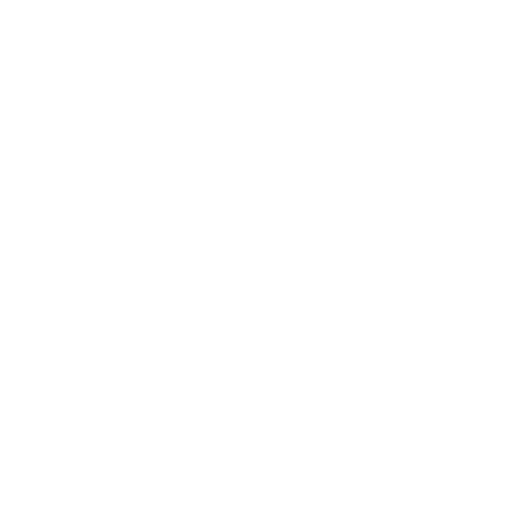

- 🔓 Application Security Engineer
- ⚔️ I participate in CTF events & solve labs HTB
- ⌨️ I hack, code & study
- 🇷🇺 Enthusiasts, writer from Russia 
- 📫 How to contact with me: SidneyJob13@gmail.com

	&nbsp;
	
	

&nbsp;

## Stats

    

        &nbsp;
    

    

        &nbsp;
    

## My contacts

	

		
		&nbsp;
		
		&nbsp;
		<a href="https://app.hackthebox.com/profile/649069">
		&nbsp;
		
		&nbsp;
		
	

## Some my skills

	
Social

	
	
	
	
	

		
	
&nbsp;

	
Programming

	
	
	
	

	
&nbsp;

	
Skills

	
	
	
	
	
	
	
	

	
&nbsp;

	
OS

	
	
	
	

## My Latest Posts

- [Werkzeug: раскручиваем arbitrary file read до RCE в веб-приложении на flask](https://habr.com/ru/articles/738238/)

## My Projects

- [Werkzeuger](https://github.com/SidneyJob/Werkzeuger)
- [FlaskApp](https://github.com/SidneyJob/FlaskApp)

